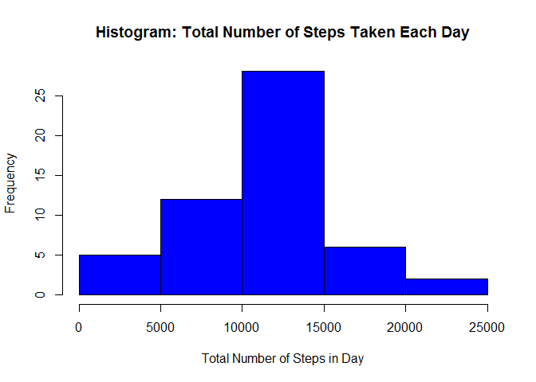
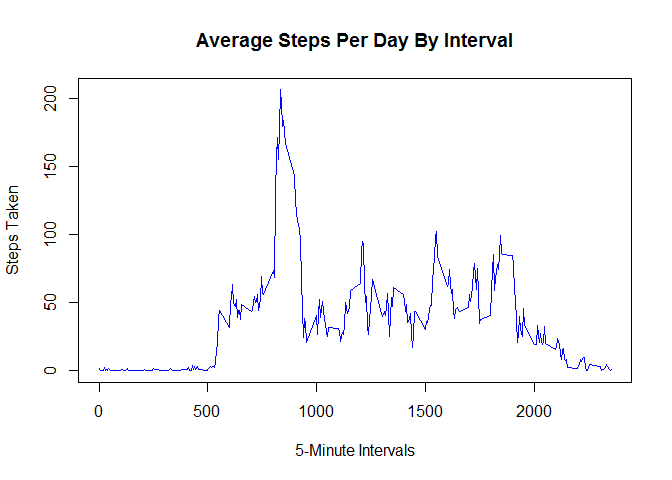

# Reproducible Research: Peer Assessment 1

*Aaron Hunter*

## Introduction
This is the first project for the Coursera Data Science track **Reproducible Research** course. In this assignment, we are putting the principles of reproducible research and literate programming into practice through loading, processing and interpreting data from a personal activity monitoring device.

NOTE: The assignment detailed in the README.md in rdpeng's repository differs, in some aspects, from the assignment detailed on the current Coursera page. For the purposes of this assignment, I am answering the questions on the page.

## Loading and preprocessing the data
Load the packages used in this analysis.

```r
library(knitr)
library(dplyr)
```

```
## Warning: package 'dplyr' was built under R version 3.3.2
```

```
## 
## Attaching package: 'dplyr'
```

```
## The following objects are masked from 'package:stats':
## 
##     filter, lag
```

```
## The following objects are masked from 'package:base':
## 
##     intersect, setdiff, setequal, union
```

```r
library(ggplot2)
opts_chunk$set(echo = TRUE)
```

The following code assumes that RStudio has been launched from this R Markdown document, and thus, the working directory was automatically set to the same folder, which is a local clone of the repository this document was found in. If RStudio was not launched from this document, the reader may have to set the working directory, using setwd(). If the repository was not cloned, and thus the activity data is not present, it can be downloaded from [the course website](https://d396qusza40orc.cloudfront.net/repdata%2Fdata%2Factivity.zip).


```r
unzip("activity.zip")
activity_data = read.csv("activity.csv", header = TRUE, colClasses = c("integer", "character", "integer"))
```

After loading the code, we can correct the data type for the date column, and then make a subset of the data without missing values.

```r
activity_data$date <- as.Date(activity_data$date)
activity_data_nona <- subset(activity_data, !is.na(activity_data$steps))
```

## What is mean total number of steps taken per day?
We can ignore the missing values in the data set.

1. Calculate the total number of steps taken per day

```r
by_day <- group_by(activity_data_nona, date)
daily_steps <- summarise(by_day, total = sum(steps))
daily_steps
```

```
## # A tibble: 53 × 2
##          date total
##        <date> <int>
## 1  2012-10-02   126
## 2  2012-10-03 11352
## 3  2012-10-04 12116
## 4  2012-10-05 13294
## 5  2012-10-06 15420
## 6  2012-10-07 11015
## 7  2012-10-09 12811
## 8  2012-10-10  9900
## 9  2012-10-11 10304
## 10 2012-10-12 17382
## # ... with 43 more rows
```

2. Make a histogram of the total number of steps taken each day

```r
hist(daily_steps$total, col="blue", main = "Histogram: Total Number of Steps Taken Each Day", xlab = "Total Number of Steps in Day")
```

<!-- -->

3. Calculate and report the mean and median of the total number of steps taken per day

```r
mean_steps <- mean(daily_steps$total)
median_steps <- median(daily_steps$total)
```
In regards to the total number of steps taken per day, the mean is 1.0766189\times 10^{4} and the median is 10765.

## What is the average daily activity pattern?
1. Make a time series plot (i.e. type = "l") of the 5-minute interval (x-axis) and the average number of steps taken, averaged across all days (y-axis)

```r
interval_steps <- aggregate(steps ~ interval, activity_data_nona, mean)
plot(interval_steps$interval, interval_steps$steps, type = "l", col = "blue", main = "Average Steps Per Day By Interval", xlab = "5-Minute Intervals" , ylab = "Steps Taken")
```

<!-- -->

2. Which 5-minute interval, on average across all the days in the dataset, contains the maximum number of steps?

```r
max_interval <-  interval_steps[which.max(interval_steps$steps), 1]
```
Interval 835 contains the maximum number of steps among all intervals, on average, across all days in the data set.

## Imputing missing values
1. Calculate and report the total number of missing values in the dataset (i.e. the total number of rows with NAs)
2. Devise a strategy for filling in all of the missing values in the dataset. The strategy does not need to be sophisticated. For example, you could use the mean/median for that day, or the mean for that 5-minute interval, etc.
3. Create a new dataset that is equal to the original dataset but with the missing data filled in.
4. Make a histogram of the total number of steps taken each day and Calculate and report the mean and median total number of steps taken per day. Do these values differ from the estimates from the first part of the assignment? What is the impact of imputing missing data on the estimates of the total daily number of steps?


## Are there differences in activity patterns between weekdays and weekends?
